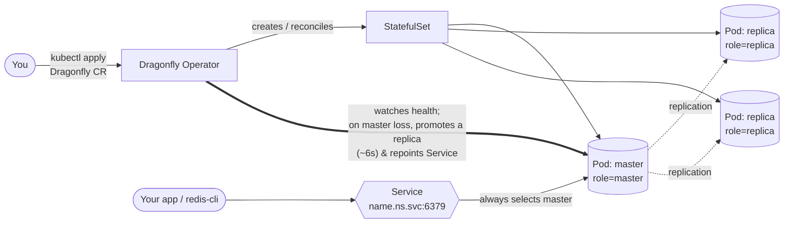

# KubeCon India — Dragonfly Operator Booth Demo Kit

A ready-to-run demo for the Dragonfly booth. Everything runs on a local `kind`
cluster on your laptop so you **never depend on conference WiFi**.

> One-liner pitch to open with:
> *"Dragonfly is a drop-in Redis/Memcached replacement that's multi-threaded —
> one node does what a whole Redis Cluster does, and this operator runs it on
> Kubernetes with automatic failover, snapshots, and auth."*

## How it works

You give the operator one short `Dragonfly` YAML; it does the rest — creates a
StatefulSet, elects a master, replicates to the others, and keeps a Service
pointed at whichever pod is currently master. Kill the master and the operator
promotes a replica in seconds — the Service follows, so clients never change
their connection string.



<details>
<summary>ASCII version (for terminals / slides without Mermaid)</summary>

```text
   you ──kubectl apply Dragonfly CR──▶ ┌──────────────────┐
                                       │ Dragonfly Operator│
                                       └─────────┬─────────┘
                                  creates/reconciles │  watches health
                                       ┌─────────────▼─────────────┐
                                       │         StatefulSet        │
                                       │  ┌────────┐                │
              your app / redis-cli     │  │ master │◀─ role=master  │
                     │                 │  └───┬────┘                │
                     ▼                 │      │ replication         │
              ┌────────────┐  selects  │  ┌───▼────┐  ┌────────┐    │
              │  Service   │──master──▶│  │replica │  │replica │    │
              │ :6379      │           │  └────────┘  └────────┘    │
              └────────────┘           └────────────────────────────┘

   kill the master ▶ operator promotes a replica (~6s) ▶ Service repoints.
   Clients keep using the SAME address the whole time.
```
</details>

## Prerequisites

- [`docker`](https://docs.docker.com/get-docker/)
- [`kind`](https://kind.sigs.k8s.io/) — local Kubernetes in Docker
- [`kubectl`](https://kubernetes.io/docs/tasks/tools/)
- Optional but great for visuals: [`k9s`](https://k9scli.io/) and a big terminal font.

## Setup

```sh
./setup.sh        # creates kind cluster, pre-pulls images, installs the operator
```

This pre-pulls and side-loads the Dragonfly image into the cluster so the booth
demo doesn't hit the network. Re-run it in the morning to be safe.

## The four demos

Each is short — booth visitors don't stop for long. Lead with #1 and #2.

### 1. Vertical scaling — the hook (~2 min)
*"One pod, all the cores."*

```sh
kubectl apply -f manifests/01-single-node.yaml
kubectl wait --for=condition=ready pod -l app=df-single --timeout=120s

# In a second terminal, show the pod saturating its CPUs:
watch kubectl top pod -l app=df-single

# Hammer it:
./bench.sh df-single
```
Talking point: *"To get this throughput with Redis you'd run and shard N
processes. Here it's one pod — bump the CPU and it scales vertically."* You can
edit `resources` in the manifest and re-apply to show it grow live.

### 2. HA + automatic failover
*"Kill the master, the operator heals it."*

```sh
kubectl apply -f manifests/02-ha.yaml
kubectl wait --for=condition=ready pod -l app=df-ha --timeout=120s

./failover.sh df-ha
```
Watch the `role` column: a `replica` gets promoted to `master`, a new pod joins
as a replica, and the Service keeps pointing at the live master the whole time.

### 3. Drop-in Redis compatibility (~1 min)

```sh
./connect.sh df-ha
# then in the redis-cli prompt:
#   set hello kubecon
#   get hello
#   info replication      <- show master + connected replicas
```

### 4. Persistence & auth — the "production-ready" beat (~2 min)

```sh
# Snapshots to a PVC (cron is every minute for the demo):
kubectl apply -f manifests/03-persistence.yaml
./connect.sh df-persist                    # set survive "data" ; wait for a snapshot
kubectl exec df-persist-0 -- ls -la /dragonfly/snapshots   # show the dump-*.dfs file
kubectl delete pod df-persist-0            # kill it; the key comes back after restart

# Password from a Kubernetes Secret:
kubectl apply -f manifests/04-auth.yaml
./connect.sh df-auth                       # no password -> NOAUTH error
./connect.sh df-auth kubecon-india-2026    # with password -> works
```

> **Booth tip (verified live):** after you delete `df-persist-0`, there's a
> ~10s window where the pod is restarting and the Service has no endpoint yet —
> `redis-cli` will say *"Connection refused."* That's expected, not a failure.
> Wait for the pod to go `1/1` (`kubectl get pod df-persist-0 -w`), then connect
> and `get survive` — the value is back, restored from the snapshot.

## Reset between visitors

```sh
./reset.sh        # removes all demo instances + PVCs, keeps cluster & operator
```

## After the conference

```sh
./teardown.sh     # deletes the kind cluster
```

## Cheat sheet (stick this on the table)

| Want to show | Command |
|---|---|
| Spin up an instance | `kubectl apply -f manifests/01-single-node.yaml` |
| See pods + roles (all instances) | `kubectl get pods -l app.kubernetes.io/name=dragonfly -L role` |
| See pods + roles (one instance) | `kubectl get pods -l app=df-ha -L role` |
| CPU usage | `watch kubectl top pod -l app=df-single` |
| Throughput | `./bench.sh df-single` |
| Failover | `./failover.sh df-ha` |
| Connect (redis-cli) | `./connect.sh df-ha` |
| Connect with auth | `./connect.sh df-auth kubecon-india-2026` |
| Operator logs | `kubectl logs -n dragonfly-operator-system -l control-plane=controller-manager -f` |
| Reset | `./reset.sh` |

## Notes

- Default Dragonfly image pinned in the manifests: `docker.dragonflydb.io/dragonflydb/dragonfly:v1.39.0`.
  Bump it if a newer release ships before the event.
- The operator installs into the `dragonfly-operator-system` namespace.
- The `Dragonfly` Service is `<name>.<namespace>.svc.cluster.local:6379` and
  always tracks the current master.
- Practice the whole flow end-to-end at least once before you go. The failover
  demo is the one people remember — rehearse the patter for it.
```
